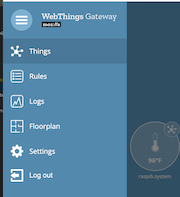

# thing-url-adapter

This is an adapter add-on for [WebThings Gateway](https://github.com/WebThingsIO/gateway) which enables users to discover and add native web things to their gateway.

**Note:** This adapter consumes [Web Thing Description](https://iot.mozilla.org/wot/#web-thing-description)s conforming to Mozilla's legacy [Web Thing API](https://iot.mozilla.org/wot) specification. It will eventually be superceded by the [wot-adapter](https://github.com/WebThingsIO/wot-adapter) which will consume W3C compliant [Thing Description](https://www.w3.org/TR/wot-thing-description/)s instead.

## Adding Web Things to Gateway
* Usually, your custom web things should be auto-detected on the network via mDNS, so they should appear in the usual "Add Devices" screen.
* If they're not auto-detected, you can click "Add by URL..." at the bottom of the page and use the URL of your web thing.
    * If you're trying to add a server that contains multiple web things, i.e. the "multiple-things" examples from the [webthing-python](https://github.com/WebThingsIO/webthing-python), [webthing-node](https://github.com/WebThingsIO/webthing-node), or [webthing-java](https://github.com/WebThingsIO/webthing-java) libraries, you'll have to add them individually. You can do so by addressing them numerically, i.e. `http://myserver.local:8888/0` and `http://myserver.local:8888/1`.

## Secure Web Things
* Web things that require jwt, basic or digest authentication can be supported by adding configuration options on the adapter page.
* To add a secure web thing:

    * Use the hamburger to open the side menu and select "Settings".

    

    * Select "Add-ons".

    

    * Find the Web Thing adapter and select "Configure".

    

    * Enter data relevant to the desired authentication method.
    * To manually enter device URLs with no authentication select 'none' for the method.

    

    * Save the entry by pressing "Apply" at the bottom of the page.
